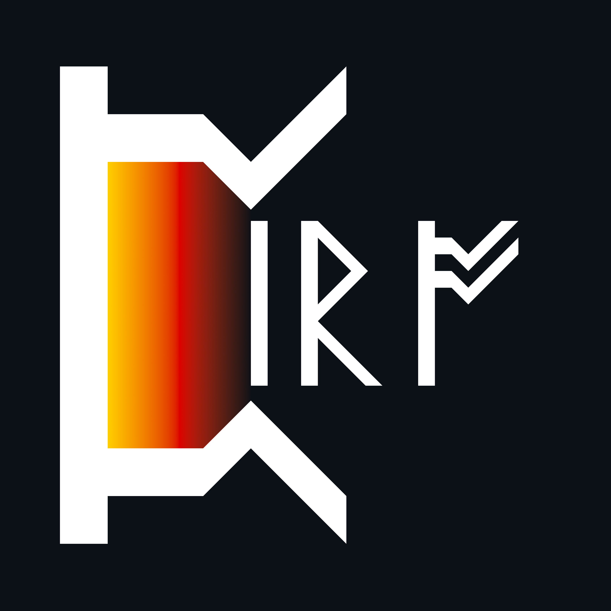

<p align="center">
 
 <h1 align="center">PIRO</h1>
 <p align="center" style="font-size: 18px;">G<b>P</b>U / C<b>P</b>U dr<b>I</b>ven nume<b>R</b>ical s<b>O</b>lver</p>


<p align="center">Powered by : 
    <a href="https://www.khronos.org/opencl/">
        
    </a>
</p>

<p align="center">
    
</p>

<h2> </h2>

## Table of Contents
- [About](#about)
- [Installation Instructions](#installation-instructions)
- [Documentation](#full-documentation)
- [Features](#features)
- [Feedback and Contributions](#feedback-and-contributions)
- [License](#license)

## About 
**PIRO** is an open-source C++/OpenCL software for performing high-performance numerical simulations. It provides modular solvers, supports various sparse formats (CSR, COO, HT), and offers kernel-level customization for advanced users. PIRO is designed for research and production workflows requiring scalable parallel matrix computations.
<p align="center">
    
</p>

## Installation instructions
See the [Quick installation](https://github.com/DjentleViBe/PIRO/wiki/end-to-end-example) section for step-by-step guidance.

## Full Documentation
See the [Wiki](https://github.com/DjentleViBe/PIRO/wiki) for full documentation, examples, operational details and other information.

## Features
- __Cross-platform CPU / GPU operation__ via OpenCL.
- __Modular equation__ solver.
- __Post processing__ export function for viewing results (e.g Paraview).
- __Benchmarking__ tools and diagnostics. 

### Operators
| Name | Description | Syntax | Status | DataType
| --- | --- | --- | --- | --- |
| $\frac{d}{dt}$ | First order time derivative | `solver.ddt_r("U")` | `Release` | ```DENSE```
| $\alpha$ . $\nabla^2$ | Laplacian | `solver.laplacian("U", "Alpha")` | `Release` | ```DENSE``` ```CSR``` ```COO``` ```HT```
| $\frac{d}{dx}$ | First order spatial derivative | `solver.gradient("U")` | `Release` |```CSR```
| $\vec{v}$ . $\nabla$ | Directional derivative along $\vec{v}$  | `solver.vector("v") & solver.gradient("U")` | `Release` | ```CSR```
***

### Schemes
| Name | Description | Number | Status |
| --- | --- | --- | --- |
| 1st order upwind | Space | 1 | `Release` |
| 1st order downwind | Space | 2 | `Release` |
| 1st order central difference | Space | 3 | `Release` | 
| Forward Euler | Time | 11 | `Release` | 
| Backward Euler | Time | 12 | `Release` |
| Crank-Nicholson | Time | 13 | `Plan` |
| Leapfrog | Time | 14 | `Plan` |
| RK2 | Time | 15 | `Plan` |
| RK4 | Time | 16 | `Plan` |
| LU Decomposition | Solver | 27 | `Dev` |
***
<p align="right">(<a href="#readme-top">back to top</a>)</p>

List of papers:
- [JOSS - A Sparse Matrix parallel solver for OpenCL](./paper.md)

## Feedback and Contributions
Contributions are always welcome to help improve this project! If you have any suggestions, feel free to fork the repository and create a pull request. If you enjoy the project, please consider giving it a star. Thank you for your support!

1. Fork the Project
2. Create your Feature Branch (```git checkout -b feature/AmazingFeature```. For performance studies, ```performance/PerformanceStudyName```.)
3. Commit your Changes (```git commit -m 'Add some AmazingFeature'```)
4. Push to the Branch (```git push origin feature/AmazingFeature```)
5. Open a Pull Request
<p align="right">(<a href="#readme-top">back to top</a>)</p>

## License
Distributed under the MIT License.
<p align="right">(<a href="#readme-top">back to top</a>)</p>
