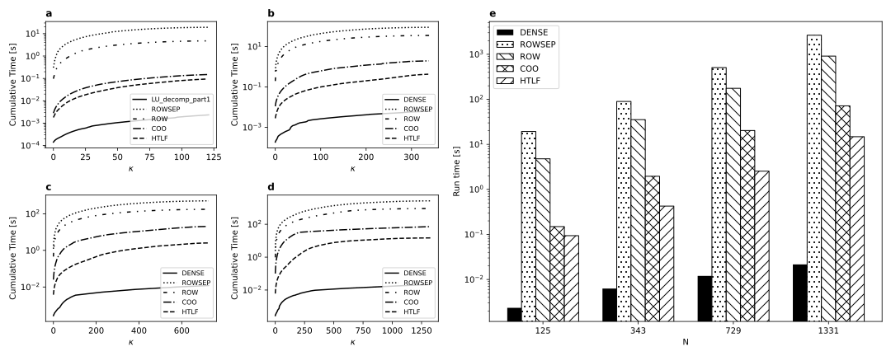

# Summary

**PIRO** is an open-source C++/OpenCL software for performing high-performance numerical simulations. It provides modular solvers, supports various sparse formats (CSR, COO), and offers kernel-level customization for advanced users. PIRO is designed for research and production workflows requiring scalable parallel matrix computations.

# Statement of Need
Compressed Sparse Row (CSR) is a space efficient way for storing sparse-matrices. It is particularly useful in situations where the matrix has many zero elements. Parallellising CSR matrix operations requires special treatment as not all elements in the matrix are readily available for independent processing. 
One solution is to process each row separately, making it straightforward to assign different rows to different threads. This approach requires the availability of atomic operations to extract good performance `@ieeepaper2012`. 
For dynamic graphs stored in CSR, parallel algorithms can insert or delete edges concurrently. Lock-free or fine-grained locking mechanisms are employed to allow multiple threads to update the structure without significant contention`@dyngraphs`. However, this introduces complexity in managing numerous locks, increasing the risk of deadlock or priority inversion if not designed meticulously `@ieeepaper2024`.
Existing libraries often lack GPU support or are tied to proprietary platforms (e.g., CUDA `@cusparse`). PIRO fills this gap by offering a novel solution (HTLF) by representing Sparse Matrices as Hash Tables (HT). It uses a hash function to compute an index (hash key) into an array of slots, where the corresponding value is stored. Insertion, deletion and lookup can be performed in amortized constant time (on average) independent of the number of non zero elements in the table, assuming a good hash function and  well-sized table. It is well known that HT are generally more efficient than search trees or other lookup structures for these operations, especially when fast access is required.

Additionally the  software offers:
- **Cross-platform CPU / GPU operation** via OpenCL.
- **Modular equation** solver.
- **Post processing** export function for viewing results (e.g Paraview).
- **Benchmarking** tools and diagnostics. 

# Algorithm - HTLF
When solving a linear system numerically, especially for large systems, directly computing the inverse is not recommended for numerical stability and efficiency. Iterative solvers are algorithms that find approximate solutions to linear systems, such as $Ax = b$, by starting with an initial guess and progressively improving it through repeated iterations. If approximate solutions are not desired, Direct methods, such as Gaussian elimination, LU decomposition, and Cramer's rule, compute the exact solution to a linear system in a finite number of steps, assuming no rounding errors occur during computation. 
LU decomposition requires convertion of the original matrix, which can be sparse by nature, into an Upper Triangular Matrix $(UTM)$, which can also be sparse, before solving. This step adds, modifies and removes elements from the origianal matrix through repeated gaussian elimination steps (${\kappa}$). If sparseness of the matrix is measured by the number of non zero elements $(nnz)$, then 
$${\mu} = nnz / N^2 $$
$$ n̄ = {\kappa} / N^2$$
$${\lambda} = nnz @ {\kappa} : 0 / nnz @{\kappa} : N - 1 $$

$nnz$ for an $UTM$ obtained after gaussian elimination of a Laplacian operator for various cell grid sizes $(N)$ is shown in the figure below.


**Figure 1** **(a)** Row filling for different N during gaussian elimination. 'x' marker denoting maximum nnz. **(b)** Curve fitting for
nnz. **(c)** Curve fitting for the load factor.<br>
The sparseness decreases initially, reaching a maximum, before finally increasing according to \autoref{fig:UTM}.

## Table size estimation
Choosing an appropriate table size for hashing is crucial for the performance of the algorithm. Since the trends are driven by $(N)$, a curve fit for ${\lambda}$ is performed as follows : <br>
$${\lambda} = a * N^b + c$$
where $N = n_x * n_y * n_z$ if $n_x, n_y, n_z$ are the number of grid cells in X, Y and Z direction respectively; the coefficients are $a = 3.3608$, $b = 0.5552$, $c = -0.014$.<br>

Then, 
$$TABLE\_SIZE = nnz / ({\lambda} * {\sigma})$$
where, ${\sigma}$ is the scaling factor, providing more flexibility.

## Hash function
A simple hash function is used : <br> 
$$key = index \ \% \ TABLE\_SIZE$$
where, $$index = row \ number * N + column \ number$$

## Method
1. The sparse matrix is initially traversed to identify indices where extra elements are to be added. They are assigned a key of -1. This is performed on the host.
2. The gaussian elimination step is performed on every element in parallel by the kernel. Resulting zero elements are concurrently set to a key of -2. This is done on the device.
3. The result is synchronised back to host and repeated for $N-1$ steps.

For a large enough $TABLE\_SIZE$, steps 1. and 2. are O(1) at best. Sometimes traversal performed in step 1 might need extra probing (upon encountering -2 before -1) during insertion due to open addressing.

# Performance

**Figure 2** Cumulative run times across gaussian elimination steps for different N. **(a)** N = 125. **(b)** N = 343. **(c)** N = 729. **(d)** N = 1331. **(e)** Total run times.

| Study            | Execution Time [s] | Host memory<br>[int, float]                  | Device Memory<br>[int, float]            |
|------------------|:--------------------:|--------------------------------------------|-------------------------------------------|
| DENSE            | 0.0062             | N + nnz + 1, <br>$N^2$ + nnz               | 1, <br>3 * $N^2$  |
| ROWSEP           | 89.6593            | N + nnz + 1, <br>2 * N + nnz                  | N + factor + 1, <br>3 * N + factor + 1       |
| ROW              | 35.3817            | N + 2 * n + nnz + 1, <br>N + 2 * n + nnz         | 3 * N + factor + 1, <br>3 * N + factor          |
| COO              | 1.9186             | N + 2 * nnz + 1, <br>2 * nnz                     | nnz + N + 1, <br>nnz                      |
| HT               | 10.7566            | TABLE SIZE + 3, <br>TABLE SIZE             | TABLE SIZE + 3,<br>TABLE SIZE             |
| HTLF             | 0.4587             | (TABLE SIZE / σ) + 3, <br>(TABLE SIZE / σ) | (TABLE SIZE / σ) + 3, <br>(TABLE SIZE / σ)|

**Table 1**: Run times and space complexities of various algorithms generating a UTM for a ```7 x 7 x 7``` grid Laplacian on an AMD Radeon Pro 5300M; $factor$ = percentage of $N^2$. 

{ width=20% }
**Figure 3**  Run times for different $\sigma$.<br>
The above figure shows performance improvements with reducing $\sigma$. The ideal value for $\sigma$ can be chosen based on use case.

# Conclusion
Hash table representaton of sparse matrices for executing operations using parallel processing gives flexibility to prioritize balance between time and space efficiency. This is benenifical as the method can be adapted easily based on usecase.

# Scope for future work
A simple hash function was used to calculate key values. Alternative hash methods and its effect on various differential operators needs to be explored. 
